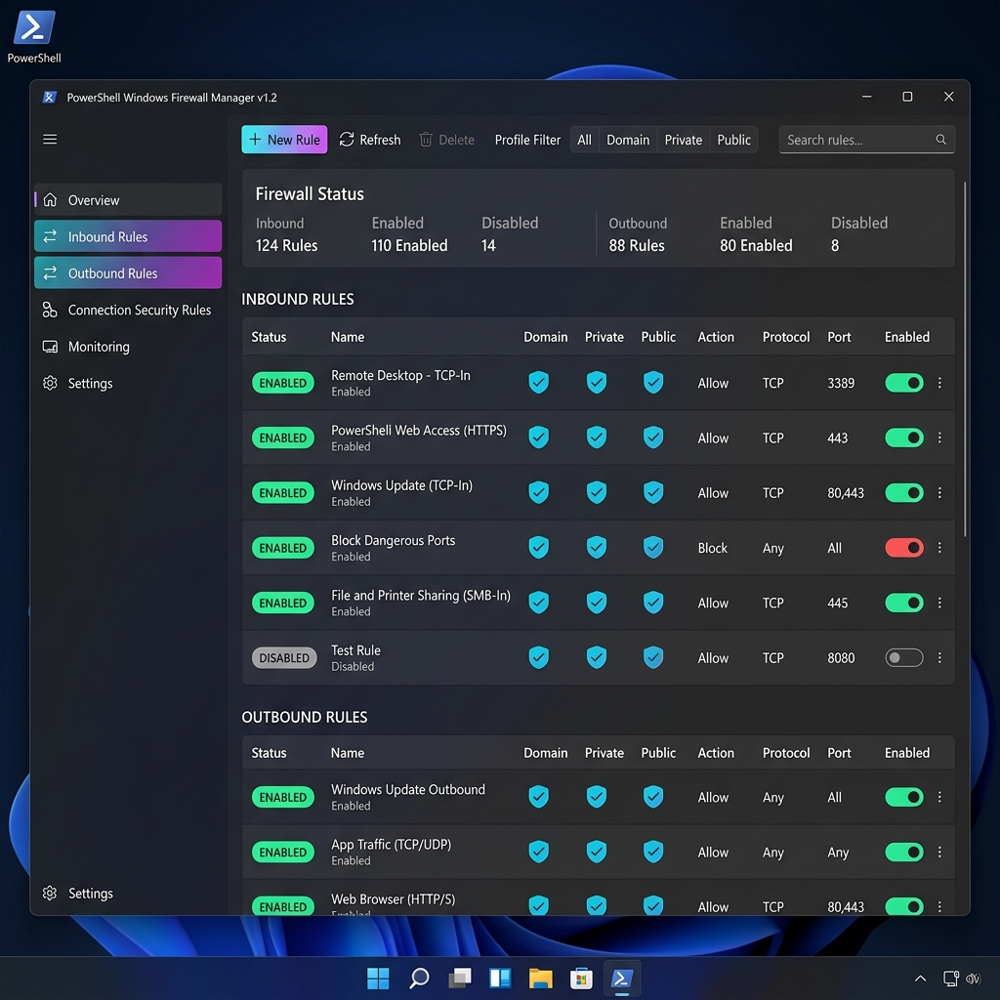

# PSAFirewall 🛡️



**PSAFirewall** is a modern, dark minimalistic PowerShell GUI for Windows Defender Firewall with Advanced Security. Built with Windows Presentation Foundation (WPF) and native PowerShell NetSecurity cmdlets (`*-NetFirewall*`), it provides a sleek, responsive alternative to the built-in Windows firewall MMC snap-in.

---

## 🌟 Key Features

### 🎨 Dark Minimalist Interface
- **Modern Theme**: Clean dark color palette (`#121214`, `#1E1E22`) with custom rounded controls and smooth hover interactions.
- **Custom Visual Badges**: Color-coded pills for rule status (*Enabled / Disabled*) and actions (*Allow / Block*).
- **Responsive Layout**: Sidebar navigation, quick statistics, live filtering, and non-blocking asynchronous data loading.

### 📥 Inbound & Outbound Rule Management
- **View Rules**: High-performance DataGrid displaying Rule Name, Group, Action, Profile, Protocol, Local/Remote Ports, and Program paths.
- **Instant Search & Filter**: Filter rules live by:
  - Text search (Name, Display Group, Program executable, Port)
  - Action (*Allow Only*, *Block Only*)
  - Status (*Enabled Only*, *Disabled Only*)
  - Profile (*Domain*, *Private*, *Public*, *Any*)
  - Protocol (*TCP*, *UDP*, *ICMPv4*, *ICMPv6*, *Any*)
- **Rule Creation & Editing Modal**: Tabbed custom dialog window:
  - **General**: Name, Description, Direction, Action (Allow/Block), Enable state.
  - **Program & Ports**: Executable program file browser (`Browse...`), Protocol selector, Local and Remote port ranges.
  - **Profiles & Scope**: Domain/Private/Public network checkboxes, Local and Remote IP scopes.
- **Quick Rule Toggles**: One-click Enable/Disable toggle and rule deletion with confirmation warnings.

### ⚙️ Firewall Profiles Management
- Real-time active status monitoring for **Domain**, **Private**, and **Public** profiles.
- Enable or disable individual network profiles.
- Configure default Inbound actions (*Block*, *BlockAllInbound*, *Allow*) and default Outbound actions (*Allow*, *Block*).
- Global Emergency Actions:
  - **Disable All Profiles** (Emergency safety toggle)
  - **Restore Firewall Defaults** (Resets firewall rules to Windows defaults)

### 📦 Backup & Policy Restore
- **Export Policy**: Save complete firewall rule configuration to `.wfw` policy backup files.
- **Import Policy**: Restore firewall rules from `.wfw` backup files with safety prompts.

---

## 📋 Requirements

- **Operating System**: Windows 10, Windows 11, or Windows Server 2016+
- **PowerShell**: PowerShell 5.1 or PowerShell 7+
- **Privileges**: Administrator Privileges (The script automatically detects elevation and requests UAC elevation if needed).

---

## 🚀 How to Run

1. Open PowerShell as Administrator (or let the script auto-elevate).
2. Navigate to the project directory:
   ```powershell
   cd "c:\AI\Code\New folder\PSAFirewall"
   ```
3. Run the script:
   ```powershell
   .\PSAFirewall.ps1
   ```

Alternatively, launch directly from any terminal or Run dialog (`Win + R`):
```cmd
powershell -ExecutionPolicy Bypass -File "c:\AI\Code\New folder\PSAFirewall\PSAFirewall.ps1"
```

---

## 🛠️ Architecture & Under the Hood

- **GUI Framework**: Embedded WPF XAML parsed via `[System.Windows.Markup.XamlReader]::Parse()`.
- **Backend Cmdlets**:
  - `Get-NetFirewallRule`, `Get-NetFirewallPortFilter`, `Get-NetFirewallApplicationFilter`
  - `New-NetFirewallRule`, `Set-NetFirewallRule`, `Remove-NetFirewallRule`
  - `Enable-NetFirewallRule`, `Disable-NetFirewallRule`
  - `Get-NetFirewallProfile`, `Set-NetFirewallProfile`
- **Asynchronous Threading**: Uses `System.ComponentModel.BackgroundWorker` to run rule queries asynchronously without locking the UI thread.
